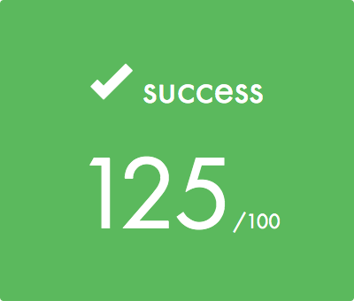

# Docker-1

The aim of the Docker-1 project is to understand the idea of containerization of services.

[Subject](./docker.en.pdf)

## Bonus part

I used Docker Compose to up a part of Elastic stack (Filebeat, Elasticsearch and Kibana) in conjunction with Apache server.

